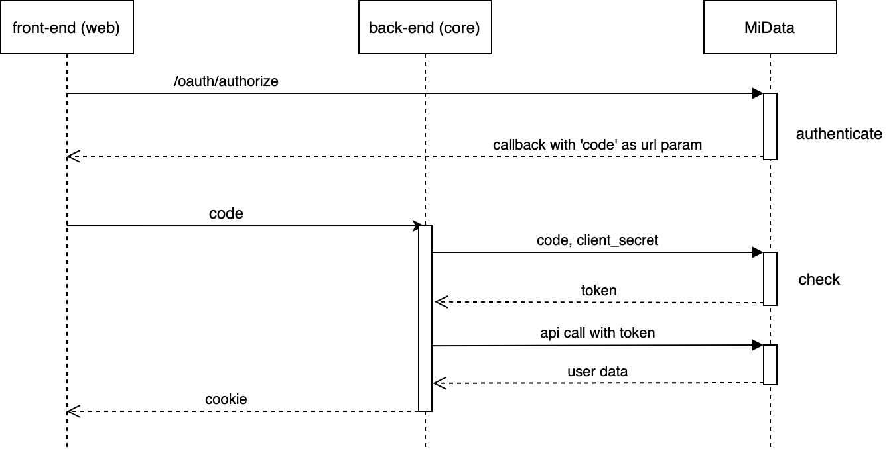

# Authentication

Users which will use this application are stored in the MiData database. The external application (MiData) is an 
OAuth 2.0 provider. Therefore, we can authenticate users via their platform. 
(similar to how "Login with Google" or "Login with Facebook" work) 
The offical hitobito OAuth documentation with additional information and details can be found 
[here](https://github.com/hitobito/hitobito/blob/master/doc/development/08_oauth.md).

## Application Specific OAuth 2.0 Flow
In order to let external users authorize our application to access their data we need to show a confirmation dialog. 
For this we need to create a request from our front-end with the appropriate parameters.

#### Scope
The `scope` is used to request access to specific user data. Hitobito defines these scopes and what will be returned
for each specific scope. We use the following scope for the oauth authorization request: `email name with_roles`.
This means that we will receive the following user properties: 
- id 
- email
- firstname
- lastname
- roles with groups

More information about the hitobito scoped can be found [here](https://github.com/hitobito/hitobito/blob/master/doc/development/08_oauth.md#scopes).


```typescript
openOAuth() {
  const url = new URL(environment.oauth.url);
  url.searchParams.append('response_type', environment.oauth.responseType);
  url.searchParams.append('client_id', environment.oauth.clientId);
  url.searchParams.append('redirect_uri', environment.oauth.redirectUri);
  url.searchParams.append('scope', environment.oauth.scope);
  window.open(url.toString(), '_self');
}
```

The code above is called and redirects the user to the MiData page which lets them log in with their MiData credentials. 
After the user completes the authentication he will be redirected. This is where the callback url comes into play. 
The user will be redirected to the specified callback url after logging into MiData and allowing HealthCheck to access 
his data. In our angular front-end application this request will be routed to the same component. 
Additionally, a `code` query parameter will be attached to our callback url.

This `code` parameter is needed to complete the OAuth flow and get the actual users data. 
Since our application consists of a front- and back-end the user will also have to be authenticated against the 
HealthCheck application in order to allow access to protected resources of the application.

As a next step we send this `code` to our back-end to the endpoint `/api/v1/oauth/v2/code` with the following function:

```typescript
public login(code: string): Observable<Person> {
    return this.http.post<Person>(environment.api + '/oauth/v2/code', {code}).pipe(map(user => {
        ...
        return person;
    }));
  }
}
```

This wil call a custom `GuardAuthenticator` (`App\Service\Security\PbsAuthenticator`) in our backend as configured 
inside `config/packages/security.yml`. This `PbsAuthenticator` will pass the `code` to the `App\Service\PbsAuthService`, 
which will use this `code` to get an access token for the MiData API, in order to get the data of the user who just logged in.

```php
/**
 * @param string $code
 * @return string
 */
private function getTokenUsingCode(string $code): string {
    $body = [
        'grant_type' => 'authorization_code',
        'client_id' => $this->pbsClientId,
        'client_secret' => $this->pbsClientSecret,
        'redirect_uri' => $this->pbsCallbackUrl,
        'code' => $code
    ];
    $response = $this->guzzleWrapper->postJson($this->pbsUrl . '/oauth/token', json_encode($body));
    return $response->getContent()['access_token'];
}
```

Next we use this access token to get the user object MiData provides:

```php
/**
 * @param string $token
 * @return array
 */
private function getUserWithToken(string $token): array {
    $headers = [
        'Authorization' => 'Bearer ' . $token,
        'X-Scope' => 'with_roles'
    ];
    $response = $this->guzzleWrapper->getJson($this->pbsUrl . '/oauth/profile', null, $headers);
    return $response->getContent();
}
```

The Symfony framework will take care of the session, after completing this procedure inside `PbsAuthenticator` 
a cookie will be added to the response which is automatically stored in the browser. 
The cookie lifetime is set to `7200s` (2 hours), this can be found inside `config/packages/framework.yml`. 
At this point we do not need our access token from MiData since the user is now authenticated against our application 
through the session/cookie and can now access protected resources provided by our application.

#### Relevant Environment Variables 
The following environment variables are relevant for the OAuth 2.0 authentication procedure:

##### pbs-healthcheck-core inside `.env.dist`
```dotenv
PBS_URL=<URL>
PBS_CLIENT_ID=<CLIENT_ID>
PBS_CLIENT_SECRET=<CLIENT_SECRET>
PBS_CALLBACK_URL=<CALLBACK_URL>
```

##### pbs-healthcheck-web inside `src/enviroments/[ENV].env`
```typescript
export const environment = {
  ... 
  oauth: {
    url: '...',
    responseType: 'code',
    clientId: '...',
    redirectUri: '..',
    scope: 'email name with_roles',
  }
};
```

#### Overview

